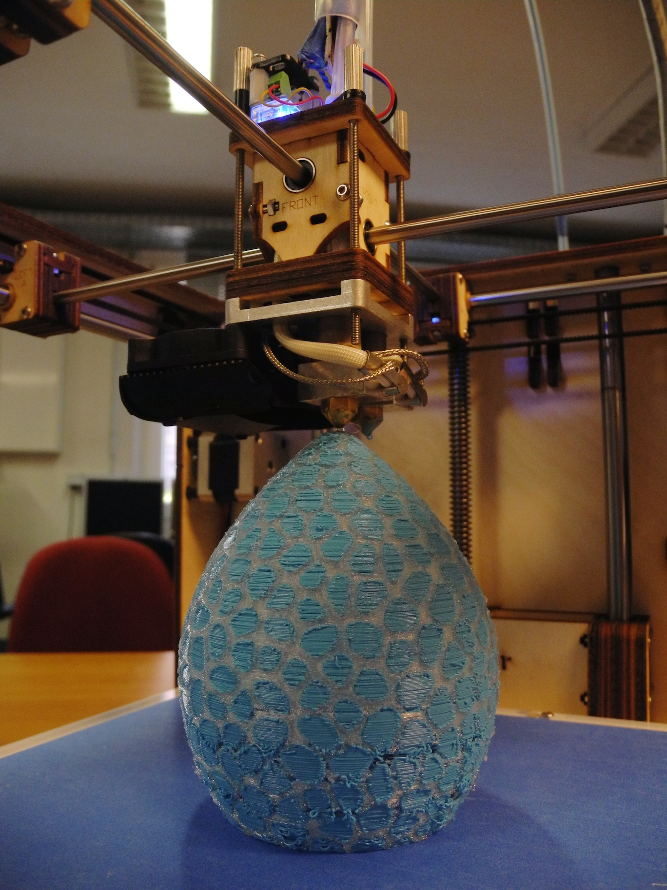
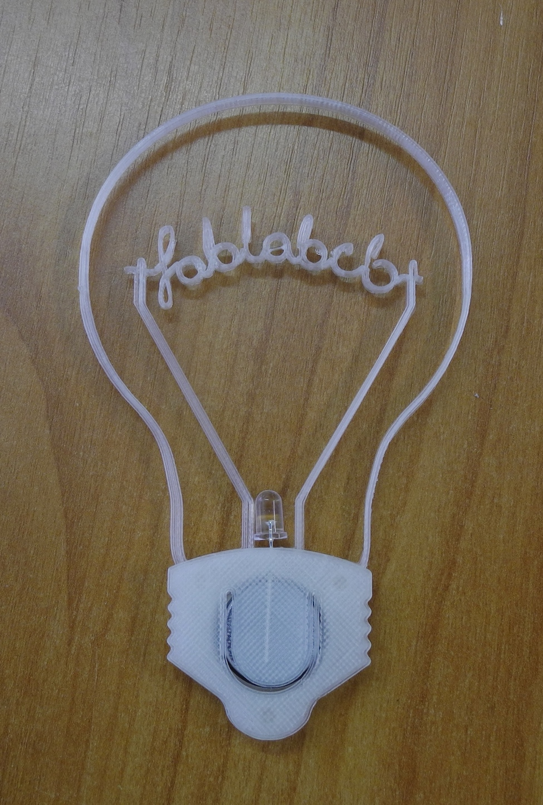

__TOC__

Wir besitzen einen [Ultimaker
original](https://www.ultimaker.com/pages/our-printers/ultimaker-original),
der mit PLA filament (Plastik) in zwei verschiedenen Farben
(Dual-Extrusion) drucken kann. Hier kann jeder nach Absprache seine
Modelle und Konstruktionen ausdrucken.

# Wie kann ich drucken? Was ist dabei zu beachten?

  - Drucken kann jeder. Bezahlt werden müssen natürlich die
    Materialkosten und anteilig die Abschreibung des Druckers.
  - Bevor wir euch an unseren Drucker lassen, müsst ihr einen
    [3D-Drucker Workshop](3D-Drucker_Workshop "wikilink") absolvieren.
  - Wenn ihr den Druck von uns erledigen lassen wollt, berechnen wir
    noch eine kleine Aufwandsentschädigung.
  - 3D Drucken ist meistens mit etwas experimentieren verbunden -
    vielleicht gelingt nicht das erste Modell so, wie Sie es sich
    vorgestellt haben. Von daher: bringen Sie Zeit mit, damit auch etwas
    schief gehen kann
  - Nicht jedes Modell ist zum Drucken geeignet - lesen Sie weiter unten
    über überhängende Bauteile und Stützstrukturen.
  - Große Modelle können schon mal mehrere Stunden bis einen halben Tag
    brauchen, bis sie fertig gedruckt sind. Wenn zum Schluss etwas
    schief geht, muss wieder von vorne gedruckt werden. Daher nochmal
    der Hinweis: planen Sie genügend Zeit für den Druck ein.

Für Auftragsarbeiten, persönliche Einweisung oder Teilnahmen an Kursen
bitte eine Mail an <3d-druck@fablab-cottbus.de> schicken.

# Ein Paar Daten zum Drucker

  - Maximales Volumen für Drucke: 21 x 21 x 20,5 cm
  - minimale Schichtdicke: 0,02 mm
  - maximale Schichtdicke: 0,3 mm
  - Pfadbreite (bedingt durch Düsendurchmesser): 0.4 mm
  - Druckgeschwindigkeit: 30 mm/s - 300 mm/s
  - Bewegungsgeschwindigkeit: 30 mm/s - 350 mm/s

Mit Software wie [Cura](https://www.ultimaker.com/pages/our-software)
kann der Filamentverbrauch und damit die Gesamtkosten für einen Druck
ausgerechnet werden. Wir würden darauf noch eine Anteilige Abschreibung
des Druckers drauf rechnen.

# Bedienung des Druckers und Vorbereitung des Modells

Gedruckt werden kann entweder von SD-Karte, per Direktverbindung zu
einem Computer oder über unseren
[OctoPrint](http://octoprint.org/)-Server. Letzterer ist bei uns im
lokalen Netzwerk unter der IP
[141.43.4.84.68:5000](http://141.43.84.68:5000) zu erreichen. Eine
Anbindung ans Campusnetz bzw. Internet ist in Planung. Für Cura gibt es
ein [Plugin zum direkten hochladen auf den OctoPrint
server](https://github.com/quillford/OctoUpload).

Für SD-Karte und den OctoPrint-Server müssen Dateien im `.gcode` Format
bereit gestellt werden. Dieser lässt sich mit Software wie
[Cura](https://www.ultimaker.com/pages/our-software) erstellen. Die
Direktverbindung zum Computer läuft auch über Cura.

Vor dem Druck muss aus einem 3D-Modell die zu fahrenden Bahnen des
Druckers generiert werden. Diese werden dann in einer `.gcode` Datei
gespeichert. Zum Erstellen des gcodes verwendet man sogenannte Slicer,
wie [Cura](https://www.ultimaker.com/pages/our-software),
[Skeinforge](http://www.reprap.org/wiki/Skeinforge),
[Kisslicer](http://www.kisslicer.com/), [Slic3r](Slic3r "wikilink"),
[Repetier Host](http://www.repetier.com/download-now/) und andere.

Die meisten Slicer verwenden `.stl` als Eingangsformat. Wenn eure
3D-Datei nicht in stl gespeichert ist, könnt ihr versuchen, sie mit
eurem Programm als stl zu exportieren oder ihr benutzt diesen
[online-Konverter](https://www.ofoct.com/de/3d-model-file-for-3d-printer-converter/3d-model-file-converter.html)
zum umwandeln.

In Cura sind folgende Einstellungen für die Qualität des Drucks
maßgebend:

  - Layer heigth - Schichtdicke - Verantwortlich für die Genauigkeit des
    Drucks. Werte von 0,02 bis 0,3 mm sind möglich. 0,06 mm ist die
    "high quality" Einstellung in Cura, 0.1 mm die "normal quality".
  - Shell thickness - Dicke der Wände - abhängig davon werden eine oder
    mehrere Bahnen gefahren
  - Bottom/Top thickness - Dicke von Boden und Decke - bestimmt die
    Anzahl der Layer, die zum Abschließen nach oben und unten gedruckt
    werden
  - Fill density - Fülldichte - abhängig davon wird die Dichte der
    Füllstruktur (rechteckige Waben) berechnet
  - print speed - Druckgeschwindigeit - sollte zwischen 30 und 300 mm/s
    liegen.

Beim Gestalten der Modelle und dem Platzieren beim Druck muss beachtet
werden, dass der Drucker nicht in die Luft drucken kann. Möglich sind
jedoch leicht schräge Konstruktionen bis etwa 50° Neigung oder
sogenanntes Bridging, bei dem Fäden zwischen zwei Punkten gezogen
werden. Das Bridging führt aber oft zu Ungenauigkeiten, wenn einzelne
Fäden nicht richtig haften.

Alternativ können Support Strukturen gedruckt werden, also stützende
Schichten, die nachher leicht vom Modell abgetrennt werden können. In
Cura lässt sich unter "Support type" auswählen "Touching build plate",
also Stützen, die nur von der Druckplatte bis zum Modell reichen, oder
"Everywhere", womit auch in Lücken im Modell Stützstrukturen gedruckt
werden.

# Troubleshooting

Bei Problemen mit dem Druck gibt es
[hier](http://support.3dverkstan.se/article/23-a-visual-ultimaker-troubleshooting-guide)
einen visuellen Troubleshooting Guide.

Falls die Düse verstopft ist:
[PLA-cleaner](http://hydraraptor.blogspot.de/2014/07/pla-pipe-cleaner.html)

# Beispiele

\]
  \] \]
 und
[Martin](Benutzer:Martin "wikilink") \]\]
 
](Drachenei.JPG
"miniatur|Dragon's Egg Lightshade by virtox Published on September 2, 2013 www.thingiverse.com/thing:144851 ")