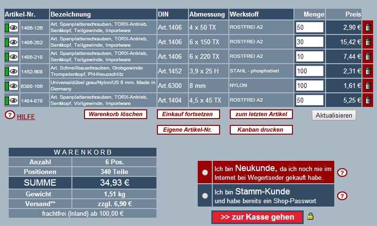
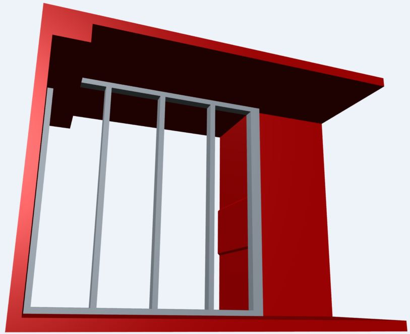
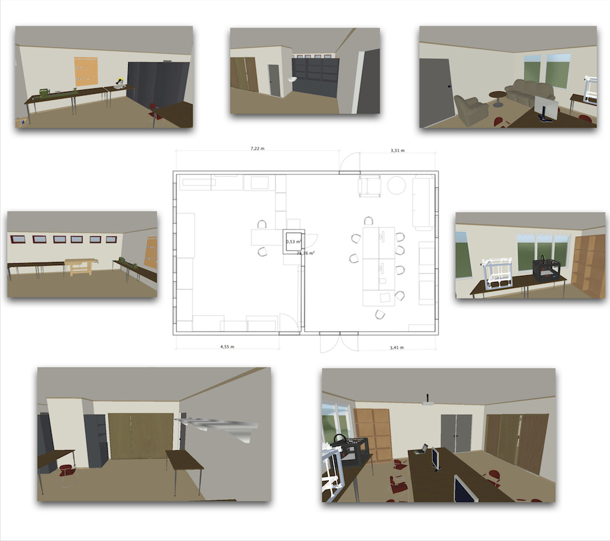

<trennwand@fablab-cottbus.de>

Teilnehmer

  - Planung: Martin S. (Ansprechpartner), Nanu
  - Ausführung: Max

TODO

  - Plan erstellen (Deadline 28.02 | ist soweit fertig)
  - Einwilligung vom HGML holen (ca. 10.3-17.3.)
  - Baumaterial besorgen (ab 20.3.)
  - Aufbau der Wand und Tür (Deadline 14.03 muss verschoben werden)

<noinclude>

## Einkaufsliste

  - \>28 Senkkopfschrauben Teilgewinde 6x150/90
  - passende Dübel
  - \>4 Senkkopfschrauben Teilgewinde 6x220/100
  - Paket 100 Senkkopfschrauben Vollgewinde 4,5x45
  - \>14 Senkkopfschrauben Teilgewinde 4x50/30
  - Paket 100 Rigips Schrauben 3,9x30
  - 6 Winkel 2mm
      - Alle Schrauben im Baumarkt überteuert. Im Internet bestellen\!
        (etwa 1/3 der Baumarktpreise)
      - hier mein Angebot für alles ausser die Winkel (0,5-1€ pro Stck.)
        
      - Hier die Reservierungsnummer für den Warenkorb: 681550-273
          - [Nanu](Benutzer:Nanu "wikilink")
            ([Diskussion](Benutzer_Diskussion:Nanu "wikilink")) 20:51,
            20. Mär. 2014 (CET): Ich denke von den Rigips-Schrauben
            können wir ruhig 200 gebrauchen. Müssen ja schließlich an
            beiden Seiten platten anbringen und da die Platten nicht so
            stabil sind, muss man sie auch mit vielen Schrauben fest
            machen.
            [hier](http://www.rigips.at/uploads/media/Rigips_Trockenbaupraxis_07.pdf)
            steht: Schraubenabstand 250mm. In der pdf gibts auch noch
            mehr Infos zur Konstruktion. In der pdf steht auch noch,
            dass der Ständerabstand 62,5 cm, also halbe Plattenbreite
            sein muss. Die Platten müssen also in der Mitte noch mal
            hinterbaut werden.
          - [Martin Silvan](Benutzer:Martinsilvan "wikilink")
            ([Diskussion](Benutzer_Diskussion:Martinsilvan "wikilink"))
            21:38, 20. Mär. 2014 (CET) Man müsste sich au mal umschauen
            bzgl. der Balken und Rigips Platten. Im Toom gibt es nur
            kleinere Balken (als 60x120 bzw 120x120) und nur
            Rigips-Platten der Länge 2600mm anstatt 2500mm. Also wenn
            jemand was sieht oder weiß, mal melden.

## Planung Trennwand

 

## Büroplan

</noinclude>