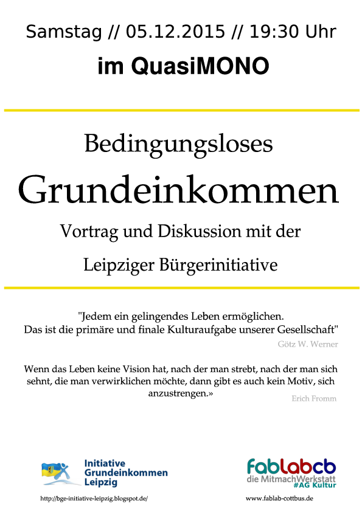

„Seit den drastischen Umstellungen und Kürzungen der Sozialetats um die
Jahrtausendwende läuft in dem komplexen Zusammenspiel von kommunalen
Ämtern, Sozialversicherungsträgern, Wohlfahrtsverbänden und Freien
Trägern sozialer Dienste nichts mehr ohne Freiwillige“ schreibt die
Bundeszentrale für politische Bildung.

Doch wer arbeitet freiwillig? Jeder dritte Bürger begleitet ein
Ehrenamt, mit steigender Tendenz, schreibt die Welt. Und das, obwohl der
Druck im Bereich der Erwerbsarbeit durch Arbeitsintensivierung und
prekäre Umstände oftmals schon sehr groß ist. Wenn ich mich entscheiden
müsste, welcher Arbeit würde ich weiter nachgehen - der Erwerbsarbeit
oder der ehrenamtlichen Arbeit? ...wohl der Erwerbsarbeit, denn zuerst
muss das Einkommen geregelt sein. Die Frage, welche Arbeit sinnvoller
oder schlicht notwendig ist, tritt dann schnell in den Hintergrund. Aber
wie wäre es, wenn wir diese Fragen tatsächlich selbstbewusst stellen
könnten?

Was ist ein Bedingungsloses Grundeinkommen? Würde sich dadurch etwas an
der beschriebenen Situation ändern? Und wie würde es sich auf
ehrenamtliche Arbeit auswirken, z.B. im Verein Fablab Cottbus e.V.?
Einladung zu Vortrag und Diskussion mit der Initiative Grundeinkommen
Leipzig.

-----

**Wo :** im quasiMONO, '''Wann : ''' am 05.Dez 2015 ab 19.30 Uhr,

**Kontakt :** [Thorsten](mailto:thorsten@fablab-cottbus.de) Bei Fragen
oder Anmerkungen zur Veranstaltungen, schreibt bitte BGE in den Betreff

-----