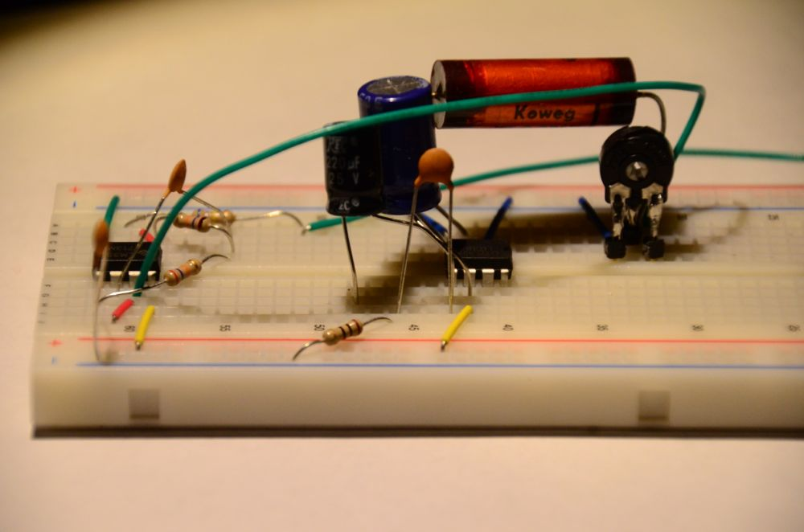

Für alle, die sich
noch überhaupt nicht mit Elektronik auskennen.

# Kosten

2€ pro Person

# Lernziele

  - Grundlagen Stromkreis
  - Bauteile (Widerstand, Kondensator, Spule, Diode, Transistor)
  - Einfache Schaltungen

# Ideen

  - Transistor als Schalter und Verstärker
  - Multivibrator
  - Schwingkreis (Radio)

# Links

  - <http://www.dieelektronikerseite.de/> (Schaltungen -\> Basteleien)
  - <http://www.b-kainka.de/bastel0.htm>