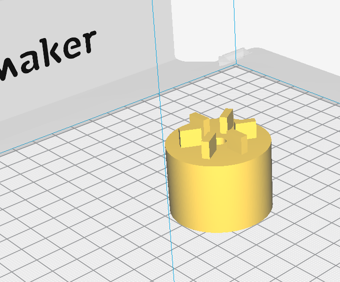

**Die Herausforderung:** Auf Outdoor-Festivals oder Sommerfesten wäre
ein Mixer für Shakes/Smoothies/Aufstriche genial. Doch häufig ist kein
Stromanschluss vorhanden bzw. es müssen extra Kabel verlegt werden oder
alle Anschlüsse sind besetzt...

**Die Idee:** <onlyinclude>Ein Mixer, der wie ein Fahrrad mit
Muskelkraft betrieben wird.</onlyinclude>

## V1

Die erste Version sah schon vielversprechend aus: die Kraft wird wie
beim jedem Fahrrad zunächst von der Kette auf das Hinterrad übertragen.
Am Gepäckträger nimmt eine Welle aus Holz (mit Fahrradschlauch
umwickelt) die Kraft auf. Praktischerweise können durch den großen
Raddurchmesser und den kleinen Durchmesser des Holzzylinders hohe
Drehgeschwindigkeiten erreicht werden. Der Adapter zwischen dem
eigentlichen Mixer und der Welle wurde mit der Oberfräse aus Holz
gefräst. Nachteile an diesem Aufbau:

  - trotz der Gummiummantelung ist die Reibung zwischen Zylinder (Welle)
    und Rad (Mantel) nicht besonders groß. Und sobald die Konstruktion
    ein wenig nass wird, "dreht das Rad durch".
  - eine Welle aus Holz hält nicht besonders lange....nach gerade mal
    zwei Tagen ist der Stab gebrochen

Datei:Mixer_V1_1.jpg|Version 1 des Fahrradmixers im Einsatz
Datei:Mixer_V1_2.jpg|Detailansicht

## V2

Bei der zweiten Version sollte deshalb die Kraftübertragung direkt von
der Kette auf eine Welle erfolgen. Das dafür nötige Winkelgetriebe war
passenderweise gerade aus einem anderen Bauprojekt übriggelieben. An
dieses wurde kurzerhand ein Fahrradritzel angeschweißt. Weitere
Verbesserungen gegenüber dem Vorgängermodell:

  - der neue Rahmen ist etwas kleiner und hat einen tiefen Einstieg,
    damit Kinder und kleinere Menschen nun auch mit dem Mixer "fahren"
    können
  - der Mixer befindet sich nun im Sichtfeld des Fahrers
  - anstelle zweier Holzstützen wird das gesamte Fahrrad nun wesentlich
    stabiler über die Fahrrad-Achsen gehalten -- am Hinterrad sogar mit
    einer zusammengeschweißten Metallkostruktion.
  - der Adapter ist aus Kunststoff und wurde am 3D-Drucker gedruckt.

  - die Unterkonstruktion für den Mixer ist vom Fahrradrahmen getrennt
    und durch andere Vorrichtungen ersetzbar. An Stelle des Mixers
    lassen sich so auch andere Geräte betreiben. Im besten Fall muss nur
    der 3D-gedruckte Adapter ersetzt werden.

Datei:Mixer_Winkelgetriebe.jpg|Das Winkelgetriebe
Datei:Mixer_Rahmen.jpg|Der neue Rahmen Datei:Mixer_Befestigung.jpg|Die
geschweißte Unterkonstruktion für den Rahmen Datei:Mixer_Mixer.jpg|Der
eigentliche Mixer -- hier muss der Adapter passen
Datei:Mixer_Halterung1.jpg| die neue Halterung wird wieder aus Holz
gebaut Datei:IMG 20180708 121911.jpg| die Feinarbeiten gelingen am
besten mit der Dekupiersäge Datei:Mixer_Halterung3.jpg| ...so sieht die
fertige Halterung aus; in der Mitte ist Platz für den Adapter
Datei:Mixer_Vorbau.jpg|die Unterkonstruktion des Mixers
Datei:Mixer_komplett.jpg|...und so sieht das ganz einsatzbereit aus.

und hier gibt es den Mixer in Aktion:
[Testfahrt](https://www.facebook.com/fablabcb/videos/1801890709903188/)