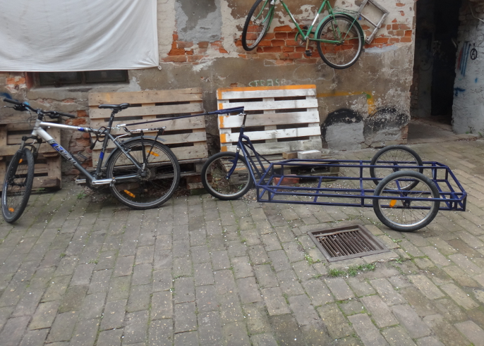
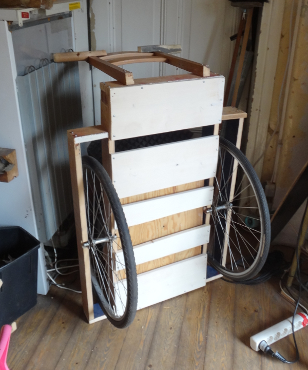

## Hintergrund

<onlyinclude> Mobilität ist eine tolle Sache. Von a nach b kommen, Dinge
transportieren -- das funktionert auch ohne Auto, wenn entsprechende
Fortbewegungsmittel verfügbar sind. Wo der Transport von Menschen mit
dem Fahrrad noch problemlos möglich ist, wird der Transport von Dingen
ab einer gewissen Größe/Anzahl/Masse zur Herausforderung... es sei denn,
ein Anhänger steht zur Verfügung. Verschiedenste Baupläne für
Fahrradanhänger sind online verfügbar. Zwei davon wurden im Frühling
2017 realisiert und können nun bei Bedarf ausgeliehen werden:

  - Ein [CarlaCargo](http://www.carlacargo.de/de/)-Fahrradanhänger nach
    der Open Source-[Bauanleitung Carla Cargo
    Crowd](http://www.werkstatt-lastenrad.de/index.php?title=Bauanleitung_Carla_Cargo_Crowd)
  - Ein Handwagen aus Holz, basierend auf der Instructables-Anleitung
    [Awesome-Bike-Trailer](http://www.instructables.com/id/Awesome-Bike-Trailer/)

</onlyinclude>

### Carla Cargo Crowd

Carla Cargo Crowd ist ein Fahrradanhänger aus Stahlrohren, lizenziert
unter einer Creative Commons Namensnennung - Weitergabe unter gleichen
Bedingungen 4.0 International Lizenz: Ein sehr ausführliche
[Bauanleitung](http://www.werkstatt-lastenrad.de/index.php?title=Bauanleitung_Carla_Cargo_Crowd)
ist online verfügbar. Unsere Version wurde mit dem
Lichtbogenhandschweißgerät des FabLabs gebaut.

Datei:Stahl.JPG| Zugeschnittene Stahlprofile zum Verschweißen
Datei:Bremse.JPG|Rad-Aufnahme des Carla Cargo Klon

Die Rücktrittbremsen der beiden hinteren Laufräder dienen als
Auflaufbremse. Dazu wird ein kurzes Stück Kette um das Ritzel gelegt,
das direkt mit dem Bremszug verbunden ist. Ein Feder löst die Bremse
anschließend wieder, indem das Ritzel in die Ausgangsposition
zurückgezogen wird - soweit die Idee. Tatsächlich kommen die Räder auch
zum Stillstand wenn die Bremse "manuell" ausgelöst wird. Aber bei der
ersten Testfahrt hatte das Auflaufen des Hängers noch nicht genügend
Kraft, um die Rücktrittbremse tatsächlich bis "auf Anschlag"
durchzudrücken. Hier wird also noch weitergebastelt....

Datei:Auflbremse.JPG| Die Rücktrittbremse wird durch eine kurze Kette
ausgelöst, die direkt am Bremszug befestigt ist
Datei:Gestaenge.JPG|...der hier betätigt wird, sobald der Hänger über
die Deichsel gegen das Fahrrad drückt

### Handwagen aus Holz

Für kleinere Transport (ohne Fahrrad) genügt dieser Handwagen. Der
Grundaufbau des
[Awesome-Bike-Trailer](http://www.instructables.com/id/Awesome-Bike-Trailer/)
besteht aus vier parallelen Bretter und einem Brett vorne und hinten,
die mit langen Holzschrauben befestigt werden. Die Bretter für unsere
Version wurden per Kreissäge aus einer Tischplatte zurechgeschnitten.
Die Ladefläche wurde (abweichend von der ursprünglichen Anleitung) ein
wenig verlängert. Die Aufnahmen für die Achsen der Räder bestehen bisher
aus einfachen Winkeln, wie sie im Baumarkt erhältlich sind. Dies hat
sich bei höheren Ladungsgewichten bisher als einzige Schwachstelle
herausgestellt. Eine verbesserte Aufnahme durch 4mm-Stahl (wie beim
Carla Cargo Crowd) ist geplant.

