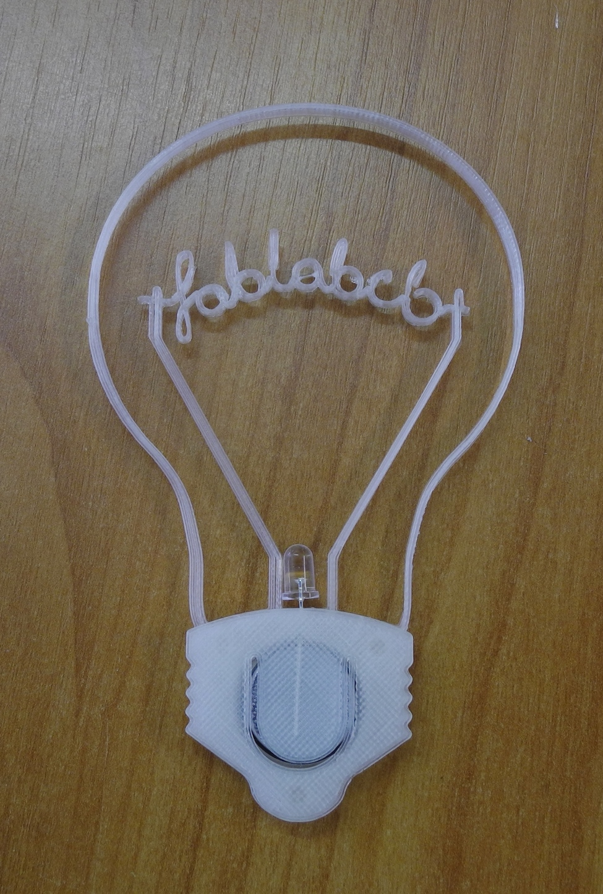

<noinclude>  Hier
können Ideen gesammelt werden </noinclude>

# [Datenlogger mit Fernübertragung](Datenlogger_mit_Fernübertragung "wikilink")

# [drawdio](http://learn.adafruit.com/drawdio)

Ein witziges Projekt: Ein Stift oder Pinsel, der beim Malen Musik macht.
Schauts euch in den Videos an\!

# [Upcycling](Upcycling "wikilink")

# [Internet-Türklingel](Internet-Türklingel "wikilink")

Eine "Türklingel", mit der man von unserer Internetseite aus anfragen
kann, ob grad jemand im fablab ist. Also quasi ein Raspberry oder
Arduino mit nem Lautsprecher oder Klingel dran und dann ein paar Knöpfe
"bin noch ne halbe Stunde da" oder "noch drei Stunden". Dann auf der
Internetseite ein Knopf, der die Klingel aktiviert und auf Antwort von
einem Knopfdruck wartet. Vielleicht kann man auch einen Drehknopf mit
variable Zeiteinstellung machen, der dann wie bei einer Eieruhr zurück
läuft.

# [Druckerschrank](Druckerschrank "wikilink")

Schrank für 3D-Drucker im FabLab.
Gründe:

  - Schutz des Druckers vor Beschädigung und Schmutz
  - Bereithalten aller benötigten Materialien und Zubehörs/Werkzeugs
    unmittelbar beim Drucker
  - Qualitätsoptimierung durch staubgefilterte Lüftung
  - Filterung der Abdämpfe mit Aktivkohlefilter.

Weitere Optimierung denkbar durch Temperaturregelung (Erstarrungstempo,
Verlauf und Stabilität)? (ggf. Subprojekt)

# [Ordnungssystem mit Barcodescanner](Ordnungssystem_mit_Barcodescanner "wikilink")

# [Tonkrugkühler](Tonkrugkühler "wikilink")

[Tonkrugkühler](http://de.wikipedia.org/wiki/Tonkrugk%C3%BChler)

# [Frästisch fürs Fablab](Frästisch_fürs_Fablab "wikilink")

# [Reverse Engineering](Reverse_Engineering "wikilink")

# [Haussteuerung](Haussteuerung "wikilink")

# [Generator mit Savonius-Rotor](Generator_mit_Savonius-Rotor "wikilink")

Ein Rotor, der nicht zwingend eine ideale Form braucht und unabhängig
von der Windrichtung funktioniert.

# [Arcade Automat](Arcade_Automat "wikilink")

Spielautomat mit dem Raspberry Pi

# [Geld Verdienen mit 3D-Druck](Geld_Verdienen_mit_3D-Druck "wikilink")

Wege mit dem 3D-Druck geld zu verdienen.