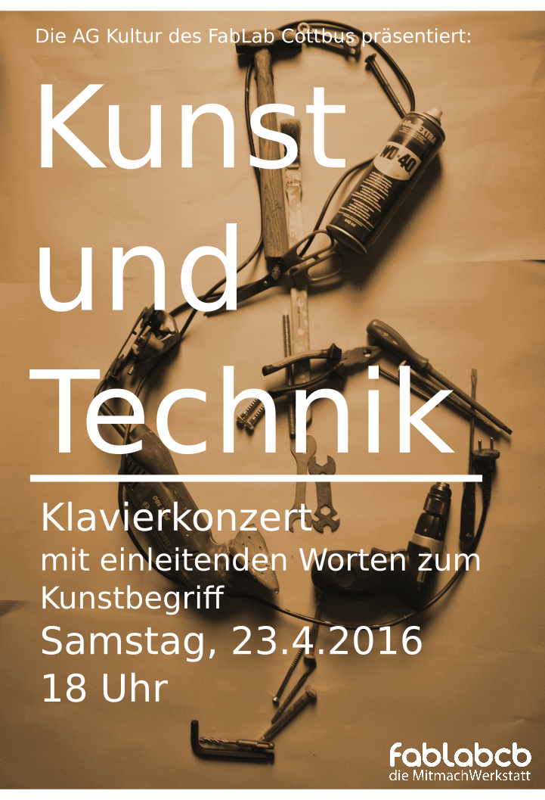

ein Klavierkonzert, organisiert von der
[AG-Kultur](AG-Kultur "wikilink"), mit einleitenden Worten zum
"Kunst"-Begriff.

Liebe Leute,

leider gibt es das über das Plakat angekündigte Klavierkonzert doch
nicht. Doch es wird zwei Stücke von Bach mit dem Cello geben und
vielleicht noch eins bis zwei klassische Stücke. Dann aber über ein
Keyboard. Die einleitenden Worte zur Kunst werde ich etwas über das
„einleitend“ hinaus gehen lassen und es soll noch eine kleine
Jamsession geben. Was wir dann dafür an Instrumenten zur Verfügung haben
ist auch vom Engagement der interessierten abhängig. Ein Keyboard und
ein E-Gitarrenverstärker sind schonmal da, zumindest geplant. Man weiß
ja nie, was schief geht. Hin oder her, es wird sicherlich ein netter
Abend.

-----

**Wo :** [im Fablab Cottbus](http://fablab-cottbus.de/index.php/Kontakt)

**Kontakt :** [Thorsten](mailto:thorsten@fablab-cottbus.de) Bei
Interesse oder Fragen zum Konzert, schreibt bitte KONZERT in den Betreff

-----