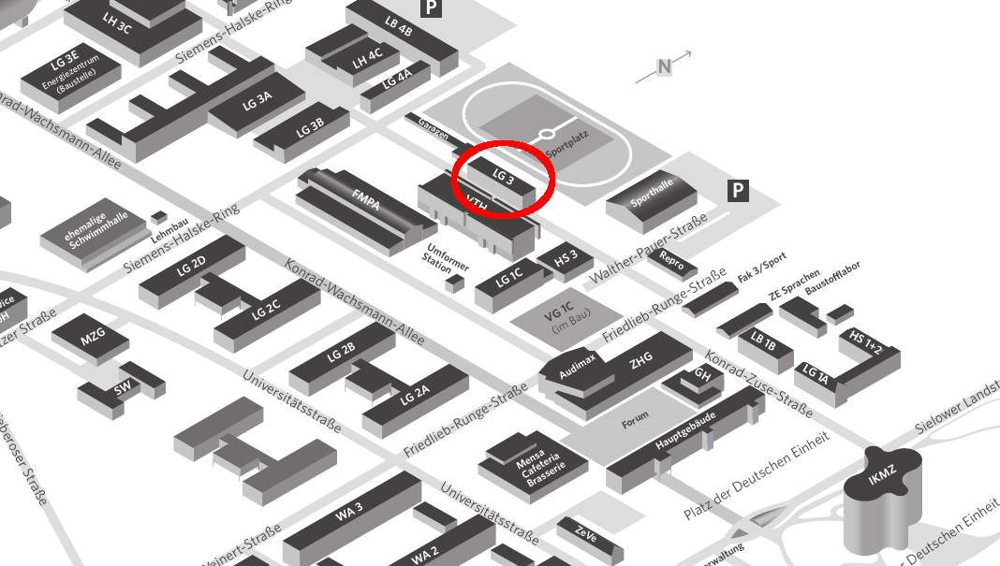

Email-Kontakt: <info@fablab-cottbus.de>

Mitglieder, die einen Schlüssel leihen möchten, schreiben bitte eine
Mail an <Schlüssel@fablab.de>

Weitere Kontaktadressen finden sich in der Übersicht der einzelnen
[Arbeitsgruppen](AG-Übersicht "wikilink")

Werkstatt-Telefon: (0355) 69 1697

# Adresse

Walther-Pauer-Straße 5, 03044 Cottbus

# Lageplan

Das fablab befindet sich auf dem Universitätsgelände der BTU Cottbus -
Senftenberg im Lehrgebäude 3 (LG3). Der Eingang ist nicht auf der Seite
des Sportplatzes, sondern auf der anderen Seite:
<http://www.openstreetmap.org/node/4317272322#map=19/51.76868/14.32352>

{{\#widget:Google Maps |width=600 |height=450 |lat= 51.7687477
|lng=14.3235483 |zoom=14 |centermarker |maptypecontrol=yes
|largemapcontrol=yes |overviewmapcontrol=yes |scalecontrol=yes }}

# Mailinglisten

Du kannst dich in folgenden Mailingslisten eintragen:

  - Newsliste für Workshops, Veranstaltungen und Änderungen der
    Öffnungszeiten
  - Interne Mailingliste für Absprachen, Treffen, Gesuche, Projekte etc.

\-\> [hier](http://fablab-cottbus.de/mail/subscribe.htm) gehts zum
Einschreiben in die Liste

# [Öffnungszeiten](Öffnungszeiten "wikilink")

### weitere Termine:

# Spendenkonto

Inhaber: FabLab Cottbus e.V.

Bank: Sparkasse Spree-Neiße

IBAN: DE27180500000190035943

BIC: WELADED1CBN

Konto-Nr.: 0190035943

BLZ: 18050000