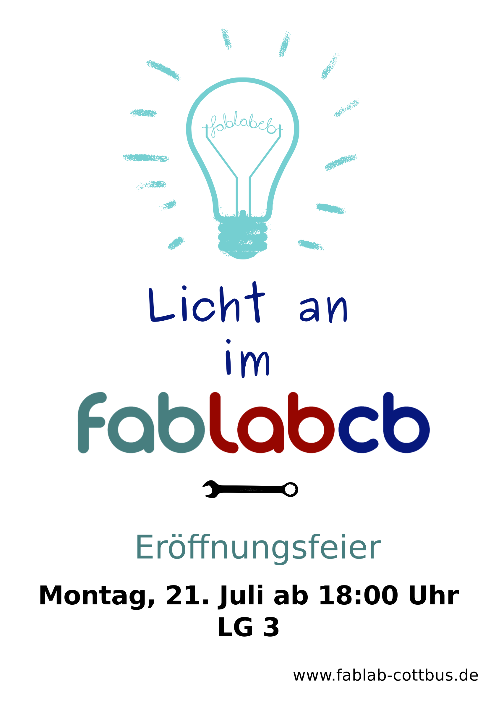

## Licht an im fablabcb\!

Programmpunkte:

  - feierliche Eröffnungsrede, Vorstellung der fablabcb und Danksagung
    an unsere Unterstützer und Sponsoren
  - Werkstattsbesichtigung
  - Ausstellungen der ersten Projekte:

3D-Drucke, Nähkünste, 3D-Matrix, solarbetriebene Fahrradpumpstation, ...

Außerdem gibt es erfrischende Getränke und ein leckeres Buffet\!

-----

Das fablab Cottbus (fablabcb) ist eine offene Mitmachwerkstatt, die
neuartige und alte Produktionsmethoden ausprobiert und entwickelt. Ob
computergesteuerte Hightech oder althergebrachte Handwerkstechniken,
wichtig ist die Begeisterung am selber ausprobieren und dem gemeinsamen
Lernen und Entwickeln.

Seit Januar haben wir von der Uni einen 80qm- Raum zur Verfügung
gestellt bekommen (LG 3). Die Werkstatt ist inzwischen schon gut
ausgestattet, viele rechtliche und organisatorische Dinge wurden
geregelt, eine Wand wurde eingezogen, der erste 3D-Drucker ist schon,
Kontakte wurden geknüpft, der Holzbearbeitungsbereich ist wurde
ordentlich aufgerüstet und die ersten Workshops fanden schon statt.

Aber am besten kommt vorbei und schaut es euch selbst an. Daher laden
wir herzlich ein zur Eröffnungsfeier am **21.7.2014 - um 18 Uhr**.