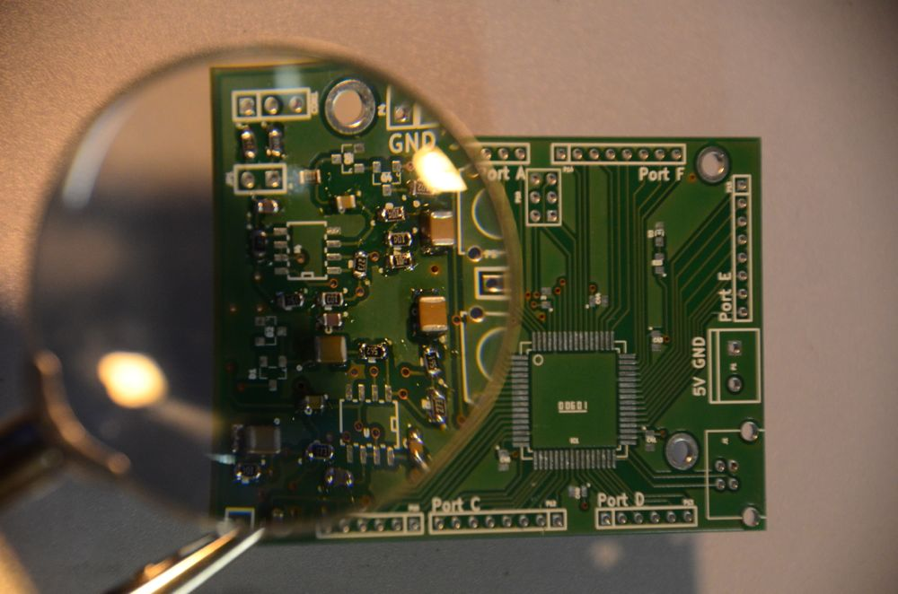

## Inhalt

Grundkurs auf Basis des Arduino Systems
Dauer: 1 Wochenende: **13. und 14. Dezember 2014** jeweils ab 13:00 (bis
ca. 17:00)
Vermittelt Möglichkeiten des Mikrocontroller. Dabei werden nur einfache
Grundlagen betrachtet.

## Benötigt für Teilnehmer

  - Laptop
  - [Arduino Software](http://arduino.cc/en/Main/Software)
  - [FabLab Lib für den
    Kurs](http://cloud.fablab-cottbus.de/public.php?service=files&t=26f9c6bf5b0ce31d10ba1bd071ae6aa3)
    (Nach 'Eigene Dokumente\\Arduino\\libraries\\' entpacken)
  - [Kurs
    Unterlagen](http://cloud.fablab-cottbus.de/public.php?service=files&t=e993ba31f4a0d30acfd4c4571b187a0c)
    Sketches mit den Programmen
  - [Treiber für den
    Programmieradapter](http://www.silabs.com/products/mcu/pages/usbtouartbridgevcpdrivers.aspx)
  - 25€ Teilnahmegebühr und Materialkosten (Materialien können mit nach
    Hause genommen werden)

## Themen

Tag 1: Grundlagen und Licht

  - Grundlagen
  - Board bauen
  - Einfache Ein-/Ausgabe Funktionen; Digital und Analog
  - LED per PWM dimmen

Tag2: Krach

  - einfache Soundausgabe
  - erweiterte Soundausgabe
  - Je nach Zeit ein kurzes Thema, welches die Teilnehmer interessiert

## Anmledung

Anmeldung direkt im FabLab zu den Öffnungszeiten oder über
info@fablab-cottbus.de
Aufgrund der begrenzten Plätze nur Anmelden wenn ihr sicher an beiden
Tagen Zeit habt.

## Teilnehmer

Max. 6 Teilnehmer

  - Thorsten
  - Christian 1
  - Christian 2
  - Anytsu
  - Paulina

## Einkaufsliste

Diese Verweise dienen als interne Referenz und werden zur Verfügung
gestellt.

<http://www.station-weisswasser.de/arbeitsgemeinschaften:digitaltechnik:brotduino:start>
USB-Seriell Wandler (Ebay CP2012)
<http://www.conelek.com/Elektronik-Laborbedarf-58/Drahtbruecken/Drahtbruecken--fuer-Steckplatinen-Set---350-Stueck-KS350.html>

## Installation unter Linux

### Installation

Einfach `sudo apt-get install arduino`. Danach müsste normalerweise
alles funktionieren. Libs kommen in den Ordner
/usr/share/arduino/libraries. Achtung: Libs müssen mit root-Rechten
kopiert werden und dann müssen die entsprechenden Userrechte noch
vergeben werden: Bsp: ` chown -r  `<Benutzername>`   `<Ordner>

### Probleme

Um den Microcontroller anzusprechen, erfolgt eine
USB-Seriell-Umwandlung. Hierzu sollte der Eintrag /dev/ttyUSB0 vorhanden
sein. Ist dies nicht der Fall, der Treiber CP210x ist aber ordungsgemäß
installiert, kann das an einem Bug liegen:
[Bugreport](https://bugs.debian.org/cgi-bin/bugreport.cgi?bug=721763)

Die Lösung ist also das Entfernen des Paketes `brltty`.

Bei mir hats danach geklappt:

`cat /proc/version` : Linux version 3.11-2-amd64
(debian-kernel@lists.debian.org) (gcc version 4.8.1 (Debian 4.8.1-10) )
\#1 SMP Debian 3.11.8-1 (2013-11-13)