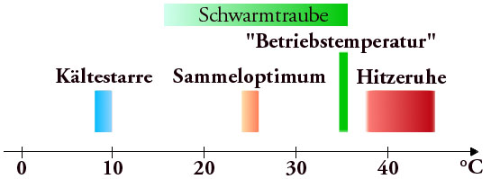
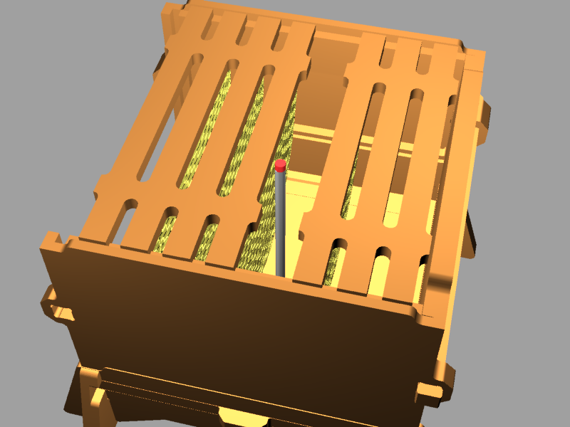

Measuring the temperature of the beehive

## what for?

from
[wikipedia](http://en.wikipedia.org/wiki/Western_honey_bee#Thermoregulation):

The honey bee needs an internal body temperature of 35 °C (95 °F) to
fly; this temperature is maintained in the nest to develop the brood,
and is the optimal temperature for the creation of wax. The temperature
on the periphery of the cluster varies with outside air temperature, and
the winter cluster's internal temperature may be as low as 20–22 °C
(68–72 °F).

Below 7–10 °C (45–50 °F) bees are immobile, and above 38 °C (100 °F)
their activity slows. Honey bees can tolerate temperatures up to 50 °C
(122 °F) for short periods.

Temperature in the Hive would be a good factor to determine bees health
in winter and to possibly take action insulating/warming the hive.

## where

  - brood (maybe with an antenna reaching into the middle of the hive?)
    see picture below

  - inside hive's entrance
  - outside hive

## sensor to use

a standard thermistor should be usable. Just needs to be waterproofed.

  - [NTC Thermistor
    plastic](http://www.conrad.de/ce/de/product/557258/NTC-Thermistor-TTC05222JSY-30-125-C-Gehaeuseart-Radial-harzbeschichtet/?ref=detview1&rt=detview1&rb=1)
  - [NTC Thermistor
    glas](http://www.conrad.de/ce/de/product/557214/NTC-Thermistor-DHT0A204F4003SY-40-200-C-Gehaeuseart-Glasgehaeuse/?ref=detview1&rt=detview1&rb=1)

## Links

<http://mietz.imkerforum.de/kontakt-impressum.html> (german)