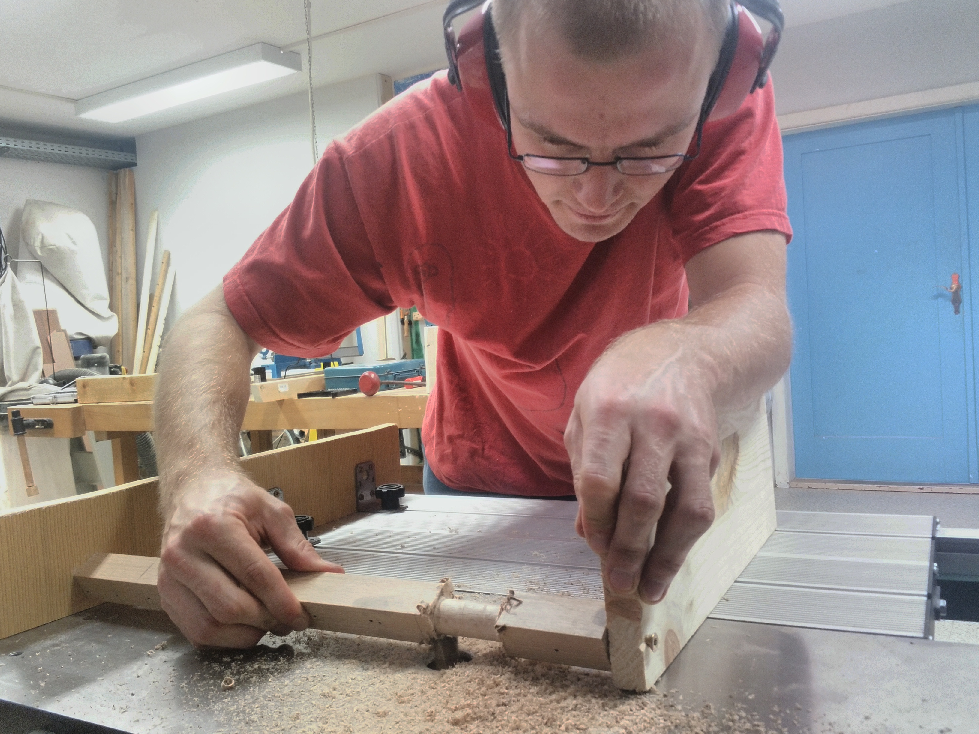
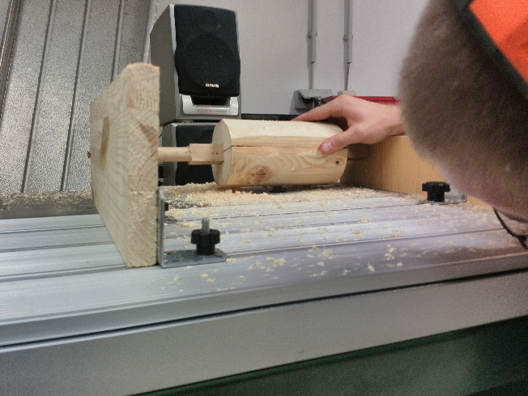
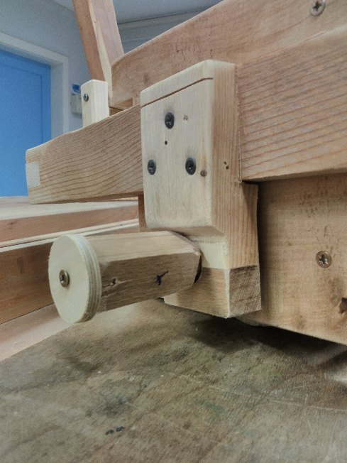
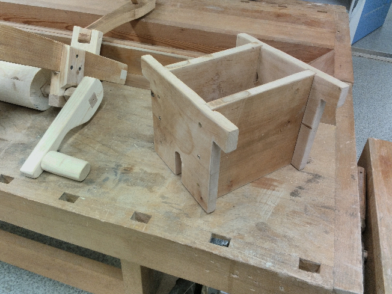
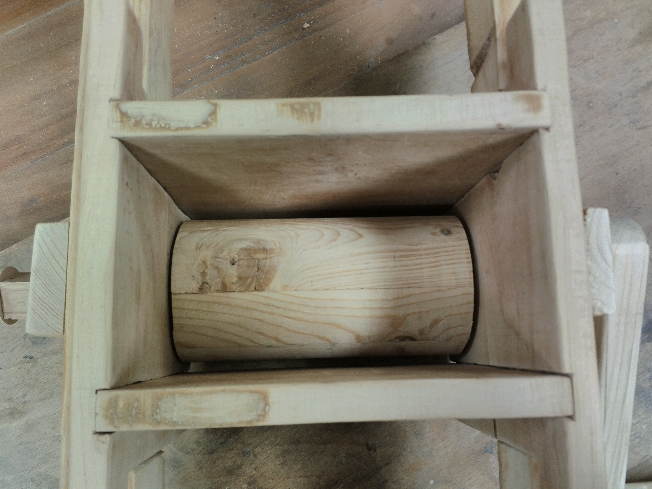
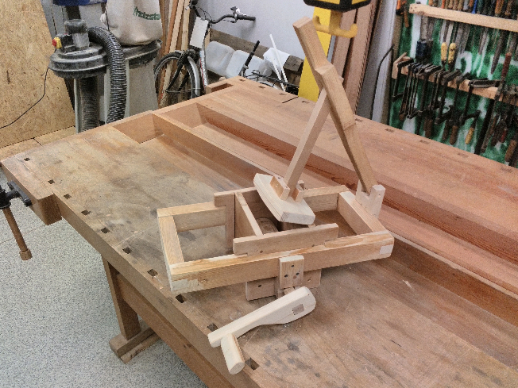

<onlyinclude>Um aus Äpfeln leckeren Apfelsaft zu pressen, wurde im
FabLab eine Obstmühle gebaut.</onlyinclude> Vorbild war dabei eine
Konstruktion dieser Website:
[1](https://woodgears.ca/cider/apple_grinder.html). Da die Drechselbank
gerade nicht benutzt werden konnte, wurden die Achse und die "Walze"
gefräst. Die Mühle lässt sich in ihre Einzelteile zerlegen, damit sie
nach jeder Beutzung komplett gereinigt werden kann.

 
   

