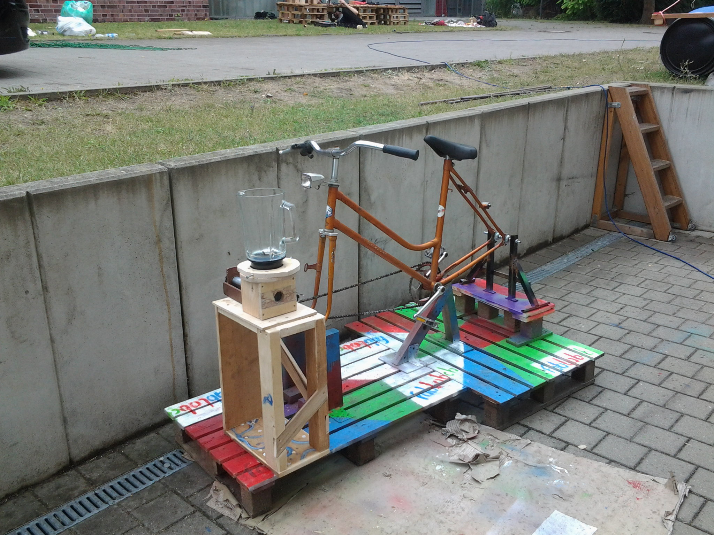

Auf dieser Seite werden die Projekte vorgestellt, welche durch die
Mitglieder des Fablabs bearbeitet werden.

# [Solarbetriebene Fahrradpumpstation](Solarbetriebene_Fahrradpumpstation "wikilink")

# [Fahrradmixer](Fahrradmixer "wikilink")

# [Handwagen und Fahrradanhänger](Handwagen_und_Fahrradanhänger "wikilink")

# [Audio Board](Audio_Board "wikilink")

# [Ehrenlicht 3.0](Ehrenlicht_3.0 "wikilink")

# [Workshop an der Wilhelm-Nevoigt Grundschule](Workshop_an_der_Wilhelm-Nevoigt_Grundschule "wikilink")

# [Holz-Projekte](Holz-Projekte "wikilink")

Datei:Stuhl3.png| Datei:Apfel detail1.png| Datei:Weihnachtsstern2.png|
Datei:Saitenkurbel.png|