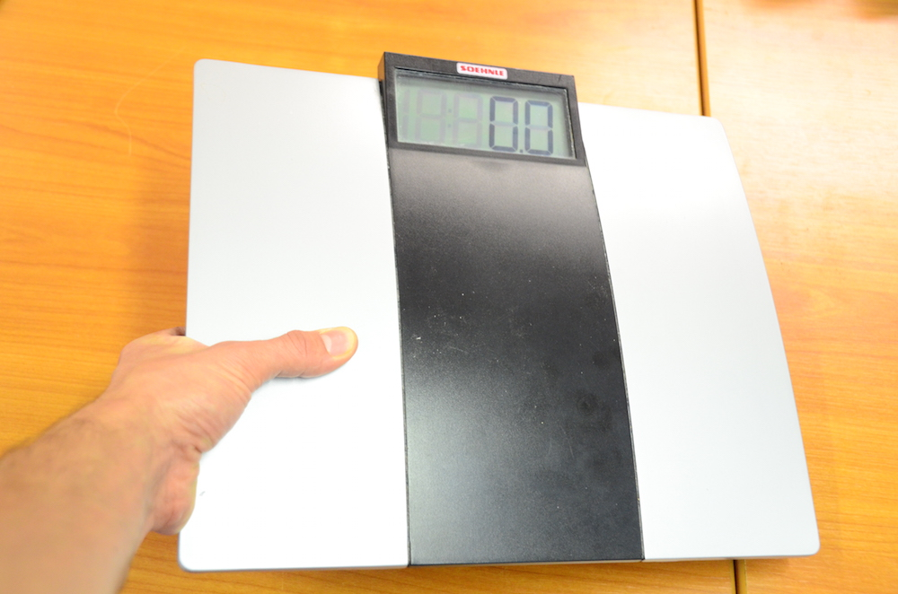

<onlyinclude>Dein Handy ist kaputt, der Staubsauger streikt oder du
brauchst Hilfe beim Flicken deiner Hose? Dann komm doch ins Fablab
Cottbus\! Wir laden zur Repair-Cafe Veranstaltung. Seit dem 1. November
2014 hilft das Fablab beim Selbermachen. Bringt einfach mit, was kaputt
ist und wir versuchen es gemeinsam zu reparieren - egal ob Elektronik,
Holzmöbel oder Textilien, an dem Tag ist für jedes Problem jemand
fachkundiges in der Werkstatt.</onlyinclude>

"Ein Repair Café ist eine Selbsthilfewerkstatt zur Reparatur defekter
Gegenstände. Freiwillige helfen mit Wissen, Werkzeug und Kaffee sowie
Rat und Tat gegen einen Unkostenbeitrag. Repair Cafés finden in fest
oder temporär zur Verfügung gestellten Räumen wie Technikräumen an
Schulen oder Vereinsgebäuden statt. Die Idee kommt aus den Niederlanden
und hat zahlreiche Nachahmer." Wikipedia

In [diesem Video](https://www.youtube.com/watch?v=kFSw1PUe66E) des
Netzwerks Reperatur-Initiativen ist sehr schön erklärt, was ein
Repair-Café ist.

# Das Repair Café in den Medien

{{\#ev:youtube|id=[http://youtu.be/gQdfjrtHYFY|480x320](http://youtu.be/gQdfjrtHYFY%7C480x320)||Ein
paar Eindrücke vom Repair-Café auf BTU CampusTV, von [Maximilian
Voigt](http://www.maximus-voigtus.de/)|frame}}

Und
[hier](http://fablab-cottbus.de/index.php/Datei:20150430_Mitschnitt_FabLab.mp3)
das Repair Café bei Radio Cottbus, vom 02.05.2015.

# Termine

  - jeden ersten Samstag im Monat, von 14-17 Uhr

# Beispiele

Im Folgenden wurde eine Waage mithilfe des 3D-Druckers repariert, denn
dieser fehlte ein Fuß, der nachgedruckt wurde. Dazu fotografierten wir
einen vorhandenen ab und zeichneten diesen mit
[Inkscape](Einführung_in_Inkscape "wikilink") nach (Open Source
Vektorgrafikprogramm). Anschließend wurde diese 2D-Zeichnung mit Hilfe
eines Plugins aus Inkscape exportiert, um es mit
[OpenSCAD](OpenSCAD "wikilink") zu einem 3D-Modell aufpolstern zu
können, darauf folgte das Ausdrucken durch unseren Ultimaker.

Der Fuß ist nicht massiv, sondern wird über einen Außenring und an
diesen befestigten Federlamellen gehalten und hat in der Mitte eine
runde Vertiefung, in die am Ende ein kurzer Metallstab eingedrückt
wurde. Dieser wird benötigt, weil der Fuß, um eine möglichst genaue
Messung zu ermöglichen, auf einem kleinen Metallsockel lagert und
deswegen an diesem Punkt besonders stabil sein muss.
  

# Anleitungen

  - [CD-Player reparieren](CD-Player_reparieren "wikilink")