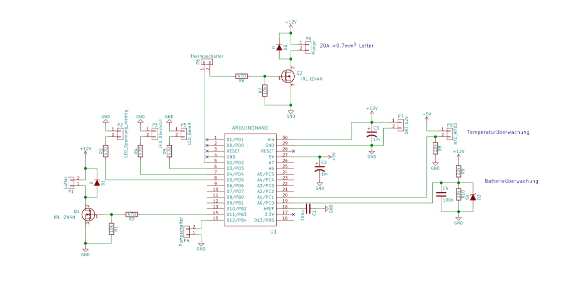

 <onlyinclude> Bei diesem Projekt
handelt es sich um eine autarke Kompressorstation, die sich durch ein
Solarpanel selbst mit Strom versorgt. Die Fahrradpumpstation ist das
erste Projekt des Fablabs Cottbus und wurde durch den Ideenwettbewerb
der BTU Cottbus gefördert. </onlyinclude>

## Idee

Das Fahrrad ist ein ökologisches Fortbewegungsmittel und wegen der
kurzen Wege in Cottbus besonders interessant. Diese Aspekte sollen durch
eine autarke Fahrradpumpstation gefördert werden, die an einem zentralen
Ort auf dem Gelände der BTU installiert die Wartung des Fahrrads
erleichtert. Somit ist die Fahrradpumpstation einerseits eine praktische
Einrichtung und andererseits ein öffentliches Symbol für das
Fahrradfahren und die dezentrale Energieversorgung - durch die
Ausstattung mit Solarpanel, Akku und intelligenter Ladesteuerung.

## Aufbau

Bei dem Bau der Station wurde überwiegend Schrott verarbeitet. Das
Gehäuse ist z.B. das einer ausgedienten DDR Kreissäge und die
Panelhalterung aus stählernen Kleiderstangen vom Sperrmüll. Gekauft
wurde die Elektronik, der Kompressor und das Solarpanel. Weil bei einem
öffentlich zugänglichen Gerät mit jeder Form der Nutzung gerechnet
werden muss, wurde neben der Ladesteuerung eine Sicherheitselektronik
verbaut, die den Aufbau vor Überhitzung schützt (12V-Betrieb, max. 20A).
Der Kern der Elektronik ist ein Arduino Nano, der die Sensorik auswertet
sowie die Nutzungsdaten der Station, Temperatur- und Batteriedaten über
eine Bluetooth-Schnittstelle zur Verfügung stellt.
 Als
Basis diente ein [Solarstromsystem der Firma
Offgridtec](https://www.offgridtec.com/komplettsysteme/solaranlagen-autark/50-watt-solar-set-big-s-50w-50ah-12v.html):

  - Anlagenleistung 50W (erweiterbar)
  - Systemspannung 12V DC
  - Abmessungen Modul 650mm x 505mm x 30mm
  - max. Laststrom 10A
  - Zelltyp monokristallin
  - enhaltenes Zubehör 1,5m Batteriekabel (6mm²) mit 30A Sicherung, 8m
    Verbindungskabel (Solarmodul zu Laderegler)
  - Enthaltener Laderegler Steca PR 1010
  - Enthaltene Batterie Offgridtec© 51Ah / 12V AGM Solar Batterie
  - Batterie Typ AGM-Batterie
  - max. Strom (Imp) 2,81A
  - durchschnittlicher Tagesertrag 200Wh (erweiterbar)
  - Kapazität bei HR10 (C10) 50 Ah (5.0A,1.75V)
  - Kapazität bei HR20 (C20) 51 Ah (1.19A,1.75V)
  - Modulspannung (Vmp) 17,8V
  - Anschlussmöglichkeiten 12V/DC
  - Leistung (Pmax) 50W
  - Leerlaufspannung (Voc) 22,3V
  - Kurzschlussstrom (Isc) 3,03A

Da die Last des Kompressors die Leistungsgrenze des Ladereglers
überschreitet, wurde eine eigene Mosfet-Steuerung gebaut (siehe
Schaltplan Q2).

## Ausrichtung

Der Idealfall ist eine südliche 30° Neigung des Solar-Panels.

## Team

Die Fahrradpumpstation wurde in mehreren Etappen erbaut und hat somit
eine Vielzahl von Erbauern, weswegen sie ein gutes Beispiel für den
sozialen Charakter unseres Fablabs ist.

## Standort

Die Station steht auf dem BTU-Gelände. Hier die genaue Position:
<http://osm.org/go/0MlLVVW~H?m&node=1628927045>

## Fotodokumentation

Datei:Fahrradpumpstation_1.JPG| Datei:Fahrradpumpstation_2.JPG
Datei:Fahrradpumpstation_3.JPG| Datei:Fahrradpumpstation_4.JPG|
Datei:Fahrradpumpstation_5.JPG| Datei:Fahrradpumpstation_7.JPG|