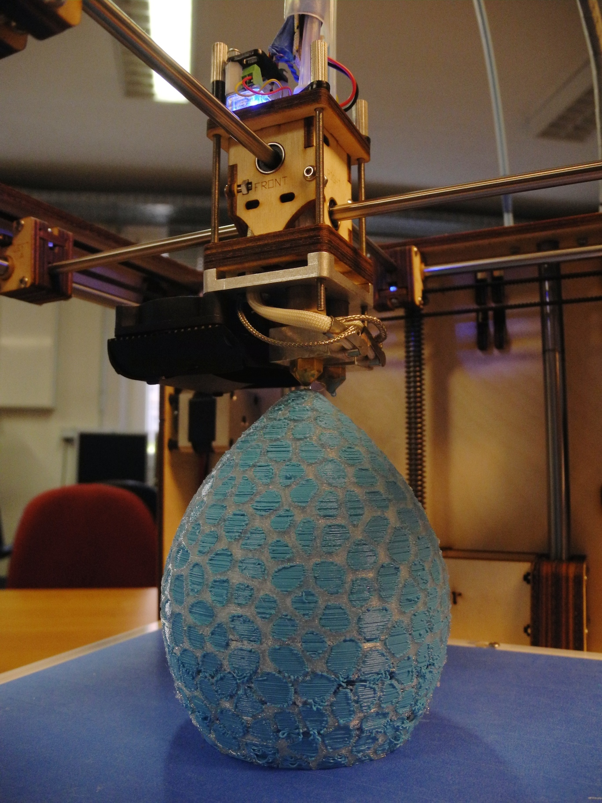

__NOTOC__

### [Öffnungszeiten](Öffnungszeiten "wikilink"):

### aktuelle [Termine](Termine "wikilink"):

{{\#ev:youtube|id=[https://www.youtube.com/watch?v=ERopzo8GTjQ|480x320](https://www.youtube.com/watch?v=ERopzo8GTjQ%7C480x320)||Ein
Beitrag über das FabLab Cottbus, zur Wandelwoche
[Berlin-Brandenburg](http://bbb.wandelwoche.org/)|frame}}

# Eine Werkstatt zum Selbermachen\!

Besucht uns in unserer Mitmachwerkstatt\! Lebt mit uns Bastelfreude und
die Lust am Experimentieren, tauscht Erfahrungen aus und verwirklicht
Eure eigenen Ideen\! Wir helfen gerne dabei und bieten das nötige
Werkzeug.

# Was ist ein fablab?

fablab steht für **fab**rication **lab**oratory (zu deutsch
"Fabrikationslabor"). Das fablab Cottbus (fablabcb) soll eine offene
Mitmachwerkstatt sein, in der neuartige und alte Produktionsmethoden
ausprobiert und entwickelt werden können. Ob computergesteuerte Hightech
oder althergebrachte Handwerkstechniken - wichtig ist die Begeisterung
am selber Ausprobieren und dem gemeinsamen Lernen und Entwickeln. So
kann jeder an den hier entstehenden Projekten mitwirken, an Kursen
teilnehmen oder bei deren Vorbereitung helfen. Jedes Projekt wird
ausführlich dokumentiert, um Interresierten das Nachbauen und
Nachvollziehen der angewandten Techniken zu ermöglichen. Wir sind
gespannt auf neue Ideen und welche Entwicklungen sich durch die
gemeinsame Tätigkeit ergeben\!

# Mach bei uns mit\!

In unserer Mitmachwerkstatt ist jeder willkommen\! Komm einfach zu
unseren regulären [Öffnungszeiten](Öffnungszeiten "wikilink") vorbei,
nimm an einem unserer [Workshops](Workshops "wikilink") teil, schreib
uns Deine Ideen an <info@fablab-cottbus.de>, hier im Wiki ([zur
Anmeldung](Spezial:Benutzerkonto_beantragen "wikilink")) oder melde dich
auf unseren
[Maillinglisten](http://fablab-cottbus.de/mail/subscribe.htm) an.

# Wie alles entstanden ist...

  - Seit Oktober 2013 sind wir ein eingetragener gemeinnütziger Verein.
  - Januar 2014 hat die BTU Cottbus uns einen
    [Raum](Die_Werkstatt "wikilink") zur Verfügung gestellt.
  - Auf den ca. 80m2 Fläche konnten wir unsere Werkstatt
    einrichten.
  - Seit dem Sommer 2014 gibt es unsere Werkstatt und stetig kommen neue
    Geräte und Ideen dazu.
  - Das Startkapital kam durch die Belegung des ersten Platzes beim
    [Ideenwettbewerb](http://www.stura-btu.de/go4it/2013/07/24/ideenwettbewerb)
    des Studierendenrates (StuRa).

# [Was über uns berichtet wird](fablabcb_in_den_Medien "wikilink")

 mit zwei Materialien\]\]

### [Kontakt](Kontakt "wikilink")

  - [Wo ist das fablab?](Kontakt "wikilink")
  - Email: <info@fablab-cottbus.de>
  - weitere [Kontaktinfos](Kontakt "wikilink")

### [Organisation](Organisation "wikilink")

### Links

  - [Projekte](Projekte "wikilink")
  - [Veranstaltungen](Veranstaltungen "wikilink")

# Weitere Informationen

### Wikibenutzung

[Informationen](Wikibenutzung "wikilink") zur Benutzung des Wikis

