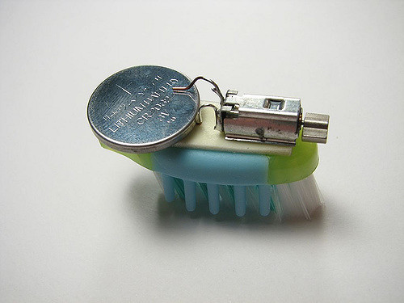
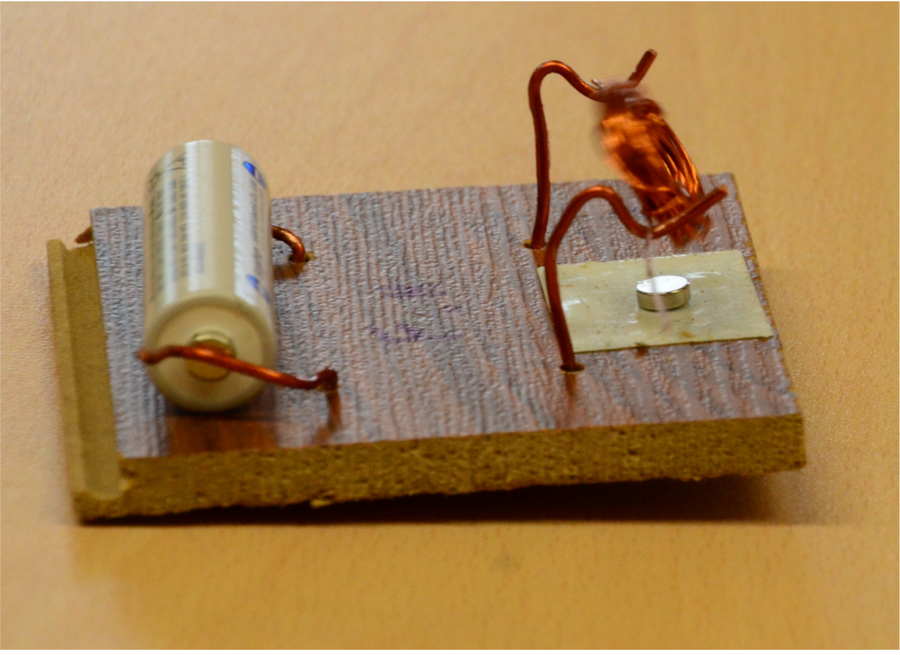

## Einleitung

<onlyinclude> Vom 30.11.2016 bis zu den Brandenburger Sommerferien 2017
veranstaltet der FabLab Cottbus e.V. im Rahmen der Nachmittagsbetreuung
der [Wilhelm-Nevoigt Grundschule](http://www.nevoigt-grundschule.de/)
jeden Mittwoch einen Workshop. Dieser hat das Ziel, elektrotechnische
Themen durch praktische sowie spielerische Betätigung zu vermitteln.
Dies ist die Dokumentation der Workshopreihe. </onlyinclude>

### Hintergrund und Entwicklung des Themas

Alles begann auf der [Nacht der kreativen Köpfe](http://www.ndkk.de/),
wo wir unsere Werkstatt präsentierten. Neben der Ausstellung aktueller
Projekte konnten vor Ort kleine "Roboter" gelötet und Taschen genäht
werden. Die Rektorin der Wilhelm-Nevoigt Grundschule sprach uns auf
Grundlage dieser Darstellung an. Es ging also explizit darum,
handwerkliche Betätigung in die Schule zu bringen, die über Schere und
Papier hinaus geht. Aufgrund der Anzahl und der Regelmäßigkeit der
Veranstaltungen sowie des eigenen Anspruches, die Bauprojekte nicht nur
nachbauen sondern auch rudimentär verstehen und in einen
soziotechnischen Zusammenhang einordnen zu können, musste ein roter
Faden her. Hinzu kam die Herausforderung, dass der Workshop, wie alle
anderen Nachmittagsangebote auch, an einem Tag den Schüler\*innen
präsentiert werden sollte, damit sie ihre Wahl treffen können. Die
Workshopreihe musste also einerseits aus handwerklichen Projekten
bestehen, die nach Spaß aussehen und andererseits einen
Kausalzusammenhang haben, der den theoretischen und soziotechnischen
Hintergrund praktisch erfahrbar macht (der in der Regel nicht nach Spaß
aussieht).  Wir
entschieden uns dafür, am Tag der Präsentation
[Bristlebots](https://en.wikipedia.org/wiki/Bristlebot) zu bauen und
fahren zu lassen. Das sind einfachste Laufroboter, Zahnbürstenköpfe, auf
denen Vibrationsmotoren aus alten Mobiltelefonen und Knopfzellen
verklebt sind, die den Kopf sanft und verspielt über Oberflächen gleiten
lassen. Diese "Roboter" verbinden viele Aspekte: Sie funktionieren durch
einen sehr einfachen Stromkreis sowie durch Teile, die im Alltag überall
zu finden sind. Hinzu kommt, dass die Motoren aus alten Mobiltelefonen
gewonnen werden müssen. Das bringt einerseits die Recycling-Thematik auf
den Tisch. Andererseits bekommen die Schüler\*innen dadurch einen
Einblick in die Tatsache, dass ein Handy mehr als ein einzelner
Gegenstand ist, nämlich eine in ein Gehäuse versammelte Anhäufung von
Komponenten. Dieser Einblick ist der erste Schritt, um moderne Technik
verstehen zu können. Die weiteren Themen der Workshopreihe waren durch
die Komponenten des Bristlebots vorgegeben, denn er sollte ja auch
ergründet werden. So ergaben sich folgende Themen: Strom, Stromkreis,
Batterie, Motor (Ferromagnetismus, Elektromagnetismus (Spule)). Die
Themen wurden so angeordnet, dass es immer wieder Höhepunkte gibt, um es
nicht eintönig werden zu lassen, damit der Spaß nicht zu kurz kommt. Im
Folgenden sind die einzelnen Themen in der behandelten Reihenfolge
aufgelistet und inhaltlich dargestellt.

### Rahmen

  - Schüler\*innen von der 2. bis zur 4. Klasse
  - 3 Workshopleiter, im Wechsel 2 pro Veranstaltung
  - Länge: 45 Minuten, immer Mittwochs
  - ca. 30 Schüler\*innen, zwei Gruppen (geteilt in Jüngere und Ältere,
    die im Wechsel kamen)

## Inhalte

### Strom/Spannung, die Schaltung (1)

Es wurde damit eingeleitet, dass wir ja eigentlich vor haben Bristlebots
zu bauen. Weil wir es aber da mit Strom zu tun bekommen, wollen wir uns
den zuvor gesondert anschauen. Ziel war es, eine Idee oder ein Gefühl
für das zu bekommen, was der Strom-Spannungszusammenhang ist und wie
ein Stromkreis verstanden werden kann, ohne über die Theorie zu
sprechen. Einleitend verwendeten wir Luftballons, die an der Kleidung
durch Reiben statisch aufgeladen wurden und dann an die Haare oder Arme
gehalten werden konnten. Die Schüler\*innen hatten großen Spaß daran,
die statische Aufladung zu erforschen und ihre Kraft zu spüren. Dieses
Video kann unterstützend zu dieser physischen Erfahrung gezeigt werden:
{{\#ev:youtube|id=[https://youtu.be/DMEVAlX_rd8|480x320](https://youtu.be/DMEVAlX_rd8%7C480x320)||Was
ist Strom?|frame}} Danach wurden Batterien herausgeholt und erläutert,
dass die Energie, die wir zuvor gespürt hatten, in diesen steckt und die
Bots mit ihnen versorgt werden. Anschließend konnten die Schüler\*innen
sich selbst in Gruppen aufteilen. Jede Gruppe bekam eine Steckplatine,
mit bunten Leuchtdioden, Batterie, Steckkabeln und Widerständen. Das
Ziel war es, die Leuchtdiode zum Leuchten zu bringen und zu erforschen,
was passiert, wenn ein Widerstand zwischen Batterie und Diode gelötet
wird. Wir waren selbst überrascht, wie viel Spaß die Schüler\*innen an
diesem Vorhaben hatten. Danach wurde darauf hingewiesen, dass der
Bristlebot ganz ähnlich mit der Batterie verbunden ist.

### der Bristlebot (2-4)

Da die Schüler\*innen sich wegen des Bristlebots angemeldet hatten,
mussten wir frühzeitig mit diesen beginnen, weil sonst Erwartungen
enttäuscht werden würden. Dazu ließen wir die Schüler\*innen wieder
Gruppen bilden. In der ersten Veranstaltung bekam jede Gruppe ein
Mobiltelefon und Schraubendreher. Ziel war es, das Gehäuse der Telefone
zu öffnen und den Vibrationsmotor gemeinsam zu finden. Damit die
Schüler\*innen wussten, wonach sie suchen, wurde ein ausgebauter Motor
zu Anfang gezeigt. In der zweiten Veranstaltung konnten die Gruppen sich
eine Zahnbürste aussuchen, von der der Kopf abgetrennt wurde.
Anschließend löteten die Workshopleiter mit der Hilfe der
Schüler\*innen Kabel an die Vibrationsmotoren. Dabei wurde das
Lötverfahren erläutert (die Schüler\*innen durften aus
Sicherheitsgründen nicht löten). Im nächsten Schritt konnten die
Gruppen ihre Motoren mit Heißkleber auf die Zahnbürstenköpfe kleben.
Beim dritten Treffen wurden Stabilisationsdrähte gebogen und ebenfalls
auf die Zahnbürstenköpfe geklebt. Hinzu kamen Knopfzellengehäuse, die
mit den Motoren verlötet und auch auf die Köpfe geklebt wurden. Danach
konnten erste Tests gemacht werden. Ziel war es, dass die Bristlebots
auf einer kleinen Rennstrecke eine Runde schaffen. Dafür
experimentierten die Schüler\*innen mit den Stabilisationsdrähten und
versuchten ein gutes Gleichgewicht zu finden.

### Ferromagnetismus (5)

Eingeleitet wurde mit den Worten, dass wir uns in der nächsten Zeit den
Elektromotor auf den Bristlebots genauer anschauen und sogar einen
eigenen bauen werden. Um das zu schaffen, würden wir uns vorher den
Magnetismus anschauen, weil der das Drehen ermöglicht. Die meisten
Schüler\*innen hatten schon mal Magnetismus in der Schule oder privat
behandelt. Um diese Kenntnisse aufzufrischen, konnten sich die
Schüler\*innen wieder in Gruppen aufteilen. Jede Gruppe bekam zunächst
einen Magneten, mit dem sie folgende Experimente veranstalten konnte:

  - Welche Materialien sind magnetisch? Jede Gruppe bekam ein Stück
    Plastik, Holz und verschiedene Metalle. Anschließend wurde gefragt,
    was die magnetischen Dinge miteinander gemeinsam haben.
  - Wie reagieren zwei Magneten aufeinander? Die Gruppen bekamen einen
    zweiten Magneten und konnten die Anziehungs- und Abstoßungskräfte
    ergründen. Anschließend wurden sie gefragt, wie diese Kräfte
    auftreten.
  - Was ist ein Magnetfeld? Die Schüler\*innen konnten ihre Magneten an
    den Boden einer Plastikwanne halten und die Musterbildungen von
    Eisenstaub beobachten, der sich in dieser Wanne befand.
  - Was ist der Nord- und Südpol eines Magneten? (Was ist ein Kompass?):
    Jede\*r Schüler\*in bekam ein Stück Styropor und einen
    magnetisierten Nagel, der in das Stück gesteckt wurde. In einer
    Wasserwanne konnten die Stücke dann getestet werden. Außen wurde ein
    Magnet an die Wanne herangeführt und dann gemeinsam die
    Ausrichtungsbewegung des schwimmenden Styroporstückes beobachtet.

### Elektromagnetismus (6)

Um auf den Motor vorzubereiten, wurde vorgeführt, wie durch das
Umwickeln von Draht um ein Stück Metall und das Anlegen einer Spannung
ein Magnetfeld entsteht. Damit die Verbindung zum Ferromagneten
ersichtlich wird, wurden beide anhand des Metallstaubes verglichen und
es wurde gezeigt, dass sie sich gleichermaßen abstoßen sowie anziehen
können. Damit dieses Prinzip auf die Drehbewegung des Motors übertragen
werden kann, bauten wir im Lab eine spezielle Anordnung von
Ferromagneten und Elektromagneten.
 Mit dieser Anordnung (sozusagen ein
selbstgebauter Schrittmotor) konnten die Schüler\*innen durch gezieltes
Ein- und Ausschalten der einzelnen Elektromagneten gemeinsam eine
Drehbewegung erzeugen. Diese Aufgabe zielte einerseits auf das
gemeinsame Koordinieren von Bewegungen ab sowie andererseits auf das
intuitive Nachvollziehen des Innenlebens eines Motors. Denn der Schritt,
der normalerweise für den Beobachter unsichtbar ist - das Ein- und
Ausschalten der Elektromagneten in einem Motor - wird so sichtbar und
erfahrbar. Beim Nachbau dieser Anordnung sollte darauf geachtet werden,
möglichst dünnen (beschichteten) Kupferdraht zu nehmen, da das
Magnetfeld dann aufgrund der Möglichkeit, eine größere Anzahl von
Wicklungen zu erzielen, stärker wird. Auch ein ausreichend starkes
Netzteil ist wichtig (\~ 5A). Die Elektromagneten sollten außerdem nicht
senkrecht zur Kreisbahn angebracht werden, sondern leicht gekippt, damit
eine zielgerichtete Drehbewegung erleichtert wird. Am Rotor in der Mitte
ist an jeder Seite ein kleiner Ferromagnet angebracht.

### der Elektromotor (7-10)

Nachdem die Schüler\*innen die Bewegung eines Motors selbst erzeugt
hatten, konnten sie nun einen eigenen bauen. Dafür wurden kleine
Brettchen vorgebohrt, in die Leiter so eingefädelt werden konnten,
sodass sie auf der einen Seite einen Träger für die selbstgebaute Spule
bildeten und auf der anderen Seite eine Verbindung zur Batterie
herstellten.  Die Spule wurde aus
einem \~1m langen beschichteten Kupferdraht gewickelt, dessen Enden auf
der einen Seite komplett abisoliert und auf der anderen nur auf einer
Linie entlang des Drahtes entschichtet wurden. Diese Linie musste so
gewählt werden, dass sie die Spule genau dann über die Träger mit der
Batterie verbindet, wenn sie leicht schräg zum aufgeklebten Magneten
positioniert ist. Dann ist der Zeitpunkt ideal, um das Magnetfeld
einzuschalten, damit die Spule eine Drehung bewerkstelligen kann. Der
Bau dieses Motors zog sich über drei Veranstaltungen hin.
Schwierigkeiten hatten die Schüler\*innen besonders mit dem Wickeln der
Spulen. Wir waren allerdings überrascht über den starken Willen der
Kinder. Sie hatten großen Spaß daran, ihren Motor zum Laufen zu bringen.
Beim Bau der Motoren orientierten wir uns an folgendem Aufbau:
{{\#ev:youtube|id=[https://www.youtube.com/watch?v=ueMQg29WmHw|480x320](https://www.youtube.com/watch?v=ueMQg29WmHw%7C480x320)||1,5
Volt Elektromotor Bauanleitung|frame}}

### Elektroschrott und Roboter (11)

Wir hatten durch die Bristle-Bots bereits Recycling zum Thema gemacht.
Aber bisher fehlte eine explizite Problematisierung. Daher entschieden
wir uns dafür, Elektroschrott zum Thema der Vorbereitung auf die Robotik
bzw. das Programmieren zu machen. Dazu Fragten wir eingangs die
Schüler\*innen, wie sie Zuhause mit unliebsamen oder kaputten
Elektrogeräten umgehen. Die Schüler\*innen erzählten uns gerne von ihren
Erfahrungen. Anschließend zeigten wir Bilder von Elektroschrotthalden
bzw. auch von solchen, wo Kinder ihren Lebensunterhalt durch die
Sortierung von Kabeln etc. verdienen. Im Zuge dessen diskutierten wir
mit den Schüler\*innen diese Situation und machten die schwere
Recyclebarkeit von Elektroschrott zum Thema. Um den Schüler\*innen klar
zu machen, wie schwer es ist, Elektroschrott aus anderem Müll maschinell
zu sortieren und gleichzeitig algorithmisches Denken erfahrbar zu
machen, hatten wir uns folgendes Setting überlegt: Auf einem Tisch wurde
Elektroschrott und normaler Müll (Flaschen, Plastikteile, Holz etc.)
ausgebreitet. Die Schüler\*innen sollten sich dann in Paaren
zusammenfinden. Einer bekam die Rolle des "Programmierers" und eine
andere des "Roboters". Der "Roboter" bekam die Augen verbunden. Der
"Programmierer" hatte nun die Aufgabe, anhand im Vorhinein festgelegter
Befehle, wie nach vorne gehen, drehen, Hand hoch, Hand runter etc., den
Roboter anzuweisen, Elektroschrott aus dem Müll zu einem anderen Tisch
zu transportieren. Um klar zu machen, was als Elektroschrott verstanden
wird, hatten wir vorher mit den Schüler\*innen den Müll begutachtet. Das
Spiel klappte sehr gut. Wichtig war immer darauf hinzuweisen, wenn die
Schüler\*innen statt der Befehle Alltagssprache nutzten oder auf das
menschliche Verständnis setzten.

### Robotik (12-14)

Das letzte und für die Schüler\*innen anspruchsvollste Projekt war der
Bau von analogen Robotern, sogenannten
[BEAM-Robotern](https://de.wikipedia.org/wiki/Beam_\(Robotik\)). Wir
orientierten uns dabei an einer [Bauanleitung aus dem Magazin
"Make:"](https://www.heise.de/select/make/2016/3/1466660464774102).
Diese Roboter bestehen aus wenigen Bauteilen, die leicht miteinander
verbunden werden können. Das Verhalten der Geräte ist aber recht
beeindruckend, da ihr Aufbau biologischen Neuronen nachempfunden ist.
Bei diesem Projekt hatten wir Material für jeden Schüler und jede
Schülerin. Allerdings gestaltete sich der Aufbau der Roboter
schwieriger, als gedacht: Es erforderte ein gewisses
Abstraktionsvermögen, sich die Teile im "Raum" sowie ihre spätere
Anordnung zueinander vorzustellen. So kamen die Schüler\*innen an ihre
Grenzen und wir mussten oft Hilfestellung leisten. Wir machten Schritte
vor, die die Schüler\*innen dann versuchen konnten nachzumachen. Am Ende
hatten leider nur drei von mehr als 15 Schüler\*innen einen fertigen
Roboter, was in erster Linie daran lag, dass wir sie nicht löten lassen
durften (denn das ist die Hauptaufgabe bei diesem Projekt). So mussten
alle durch den Flaschenhals der Betreuer. Mit mehr Zeit und weniger
Schüler\*innen (sowie der Möglichkeit, die Kinder auch den Lötkolben
benutzen lassen zu dürfen) wäre dieses letzte Projekt besser gelaufen.
{{\#ev:youtube|id=[https://youtu.be/ew7AqRCvls8|480x320](https://youtu.be/ew7AqRCvls8%7C480x320)||Einer
unser BEAM-Roboter in Aktion|frame}}

## Erfahrungen

Keiner von uns hatte pädagogische Vorerfahrung. So mussten wir uns die
Vorbereitung und Durchführung des Workshops ertasten. Insbesondere am
Anfang neigten wir noch dazu, Sachverhalte zu erklären. Das
funktionierte allerdings nie. Die Schüler\*innen hörten uns keine zwei
Minuten zu, weswegen wir theoretische Aspekte versuchten erfahrbar zu
machen. Das klappte immer besser. Allerdings hatten wir in der Regel
nicht genug Material, weswegen wir immer Gruppen bilden ließen (das
schien für uns auch aus pädagogischer Sicht Sinn zu machen). Leider
stritten sich die Schüler\*innen dann oft darum, wer was machen darf.
Auch kamen oft Gruppen von Schüler\*innen zusammen, die sich nicht
mochten. Für uns war es eine große Herausforderung, diese Spannungen
abzufangen und ein gemeinsames Arbeiten zu fördern. Dass Gruppenarbeit
problematisch ist, zeigte sich explizit, als die Motoren gebaut wurden.
Denn plötzlich waren die Schüler\*innen konzentriert, da sie ihr eigenes
Objekt gestalten sowie zeigen konnten und sich nicht abstimmen mussten.
Überrascht wurden wir von der Schwierigkeit, die Kreativität und
Eigenverantwortung der Schüler\*innen anzuregen. Sobald wir eine Aufgabe
offener kommunizierten, kam Ratlosigkeit auf und Kommentare wie: "Was
soll'n wir denn jetzt machen?" Das veranlasste uns dazu, genauere
Vorgaben zu machen. Wie dann aber ein projektoffener Unterricht
gestaltet werden kann, der individuelle Entfaltungsmöglichkeiten
ermöglicht, ist uns nicht klar. Wenn es da Tipps oder andere
Erfahrungen gibt, freuen wir uns auf Post\!