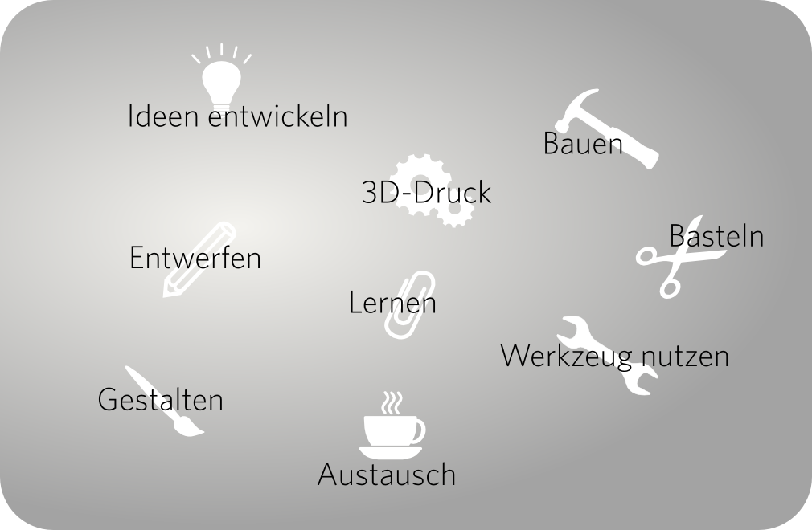

Willkommen in der Mitmachwerkstatt\!

## Was ist ein fablab?

fablab steht für **fab**rication **lab**oratory (zu deutsch
"Fabrikationslabor"). Das fablab Cottbus (fablabcb) soll eine offene
Mitmachwerkstatt sein, in der neuartige und alte Produktionsmethoden
ausprobiert und entwickelt werden können. Ob computergesteuerte Hightech
oder althergebrachte Handwerkstechniken - wichtig ist die Begeisterung
am selber ausprobieren und dem gemeinsamen Lernen und Entwickeln. So
kann jeder an den hier entstehenden Projekten mitwirken, an Kursen
teilnehmen oder bei deren Vorbereitung helfen. Jedes Projekt wird
ausführlich dokumentiert, um Anderen das Nachbauen und Nachvollziehen
der angewandten Techniken zu ermöglichen. Wir sind gespannt auf neue
Ideen und welche Entwicklungen sich durch die gemeinsame Tätigkeit
ergeben\!

## Fakten

  - Seit Oktober 2013 sind wir ein eingetragener gemeinnütziger Verein.
  - Januar 2014 hat die BTU Cottbus uns einen
    [Raum](Die_Werkstatt "wikilink") zur Verfügung gestellt.
  - Auf den ca. 80m2 Fläche konnten wir unsere Werkstatt
    einrichten.
  - Seit dem Sommer 2014 gibt es unsere Werkstatt jetzt und stetig
    kommen neue Geräte und Ideen dazu.
  - Das Startkapital kam durch die Belegung des ersten Platzes beim
    [Ideenwettbewerb](http://www.stura-btu.de/go4it/2013/07/24/ideenwettbewerb)
    des Studierendenrates (StuRa).

## Satzung

[Download als
pdf](http://fablab-cottbus.de/images/5/52/Satzung_8Seiten.pdf)